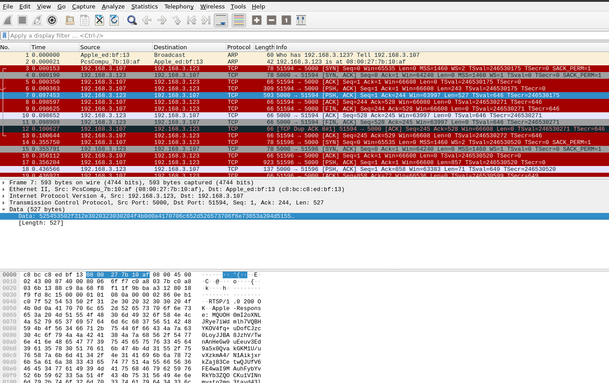
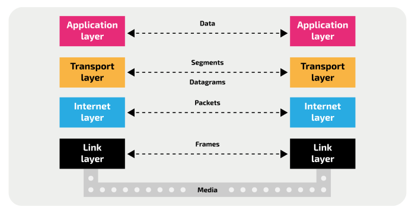
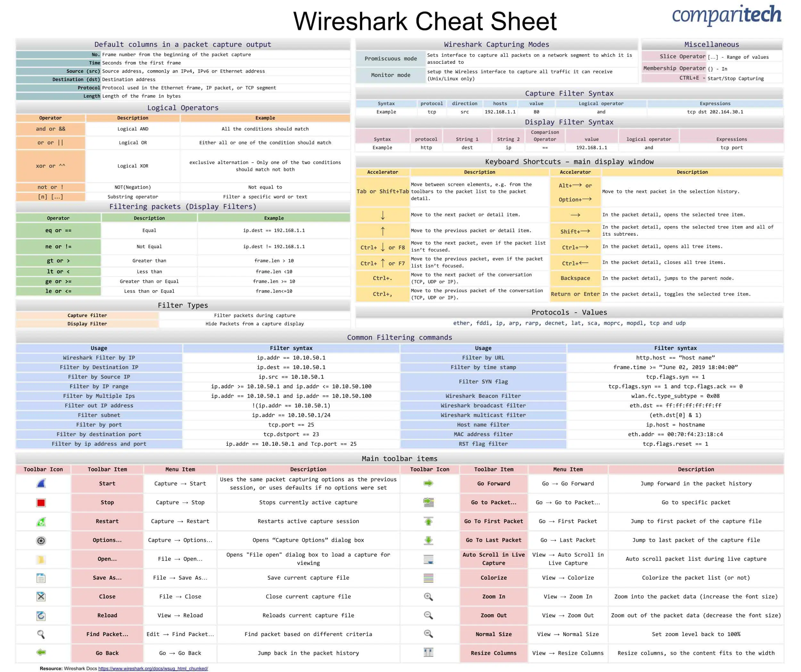

# Wireshark

## Allalaadmine

[Allalaadmise link](https://www.wireshark.org/#download)

Debian-põhistes Linuxites saab kasutada ka käsku

```bash
sudo apt install wireshark
```

## Wireshark tööriist

Wireshark on võrguanalüüsi tööriist, mis võimaldab:

* koguda
* salvestada 
* analüüsida

pakette Ethernet, Wi-Fi, Bluetooth, USB jne meediumites.



### Taust



### Kasutamine



### Näidised

* [ARP (Address resolution protocol)](assets/arp.pcap)

* HTTP (Hyper Text Transfer Protocol)

  * [2 päringut](assets/http.cap)

  * [Fail](assets/large-http.trace)

* [DJI droon](assets/dji.pcap)

* [STANAG 5066](assets/S5066-HFChat.pcap)

### Salvestamine

### Lisalugemine

[Wi-Fi monitooring](https://wiki.wireshark.org/CaptureSetup/WLAN)


## Kasutatud materialid

[Wiresharki kasutajamanuaal](https://www.wireshark.org/docs)

[Wireshark cheatsheet](https://cdn.comparitech.com/wp-content/uploads/2019/06/Wireshark-Cheat-Sheet-1.jpg.webp)

[TC/IP stack pilt](https://isaaccomputerscience.org/api/v3.2.0/api/images/content/computer_science/computer_networks/the_internet/figures/isaac_cs_net_internet_layer_overview.svg)

[Näidised lehelt](https://wiki.wireshark.org/SampleCaptures)
